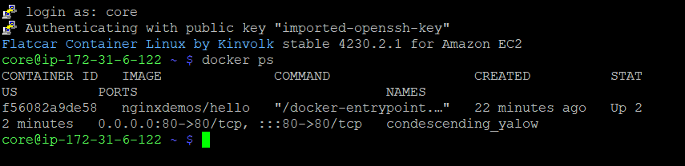
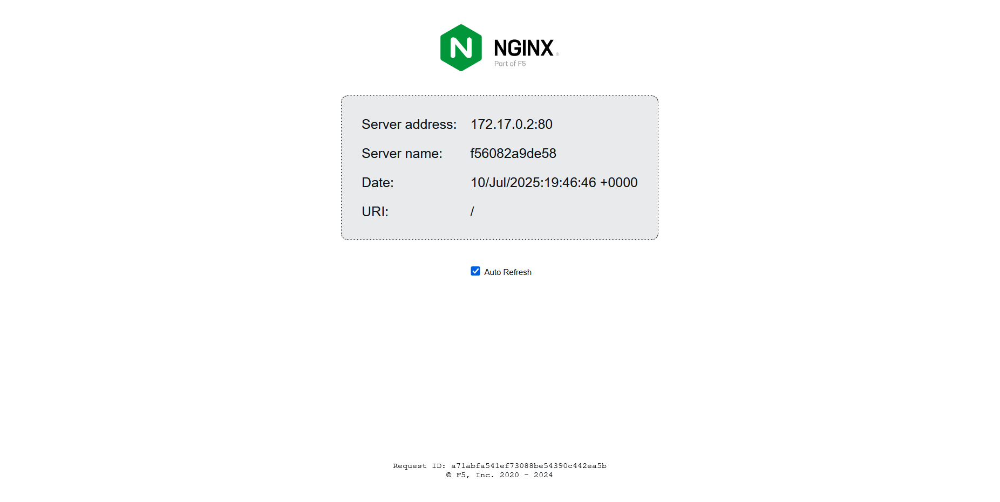

# 🚀 Flatcar + Docker + Nginx on EC2 (Ignition-Based Deployment)

This project demonstrates how to deploy a Dockerized Nginx container automatically on an **immutable Linux OS** (Flatcar Container Linux) using **Ignition configuration** — no SSH provisioning or manual setup required.

Built and tested on **AWS EC2**, this setup uses:

- 🧊 Flatcar Container Linux (minimal, secure, auto-updating OS)
- ⚙️ Ignition (for first-boot automation)
- 🐳 Docker (container runtime)
- 🌐 `nginxdemos/hello` container (prebuilt Nginx Hello World page)

---

## 📦 What This Setup Does

- Launches a Flatcar EC2 instance with Docker enabled
- Runs a demo Nginx container automatically at boot
- Exposes port 80 so you can view the result in a browser
- Requires **zero SSH provisioning** once deployed

---

## 📸 Demo Screenshots

### ✅ Docker container running on Flatcar:



---

### 🌐 Nginx Hello World (container output):



---

## 🧾 Ignition Config (Sample)

The `nginx-demo.ign.json` file configures systemd to:

1. Enable the Docker service
2. Pull and run the `nginxdemos/hello` container at boot

```json
{
  "ignition": {
    "version": "3.0.0"
  },
  "systemd": {
    "units": [
      {
        "name": "docker.service",
        "enabled": true
      },
      {
        "name": "hello.service",
        "enabled": true,
        "contents": "[Unit]\nDescription=Hello World Container\nAfter=docker.service\nRequires=docker.service\n\n[Service]\nExecStart=/usr/bin/docker run -d -p 80:80 nginxdemos/hello\nRestart=always\n\n[Install]\nWantedBy=multi-user.target"
      }
    ]
  }
}

```

## 💡 What Else Can Flatcar Be Used For?

Flatcar is designed for minimal, secure, and automated environments. Here are some simple, beginner-friendly use cases:

- 🐳 **Running containerized apps**: Just like this demo, you can auto-run any Docker container.
- 📦 **Web servers**: Deploy Nginx, Apache, or Node.js-based apps with no OS overhead.
- 🔁 **Stateless workloads**: Ideal for apps that don’t store local data (e.g., frontend services, API gateways).
- 🔐 **Security-hardened infrastructure**: Comes with automatic OS updates and minimal attack surface.
- ☁️ **Cloud VM automation**: Launch VMs in AWS, Azure, or GCP with identical behavior using Ignition JSON.
- 🧪 **Learning infrastructure-as-code**: A great starting point to practice declarative server setups.

Flatcar is lightweight and built for the cloud — it works great when you want to automate, simplify, and containerize your workloads.


